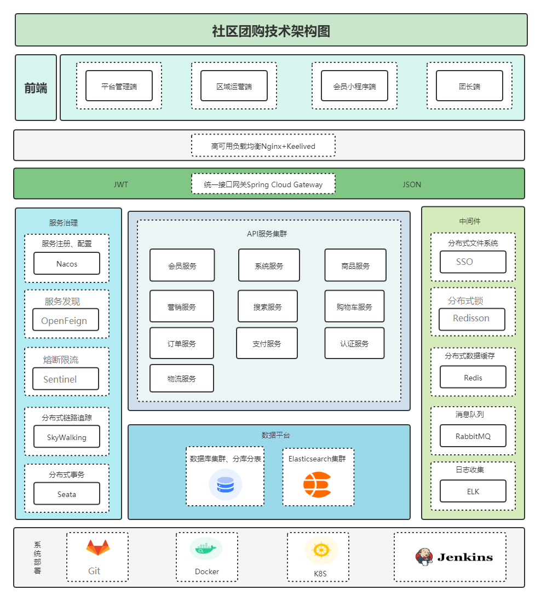

# README

**技术选型：** SpringBoot、SpringCloud、MyBtis-Plus、MySQL、Redis、Redisson、RabbitMQ、ElasticSearch 、xxl-job

**项目描述：**  优选社区购是一个基于互联网的社区团购平台，采用“当日下单+次日送达+门店自提”的模式，专注于本土社区团购业务。我们致力于构建一种真实居住社区内居民团体的互联网线上线下购物消费行为，以实现区域化、小众化、本地化和网络化的团购形式。通过依托线下门店，我们打造了社区和团长之间的社交关系，从而实现生鲜商品的流通的零售模式。该项目主要分为两个板块：前台微信小程序端和平台管理系统。平台管理系统涵盖了仓库/区域管理、会员管理、商品管理和数据统计等模块。微信小程序端包括营销服务、搜索服务、购物车服务、订单服务、支付服务和认证服务等模块。

**技术架构：**

**使用说明：**

1. 克隆或下载这个仓库到你的本地计算机：`git@github.com:Weiguanghao918/ShangSelected.git`
2. 引入后台管理[ERP系统](git@github.com:Weiguanghao918/ssyx-admin.git)以及[微信小程序端系统](git@github.com:Weiguanghao918/ssyx-wechat.git)
3. 启动[service](service)层中的所有模块即可正常访问。

